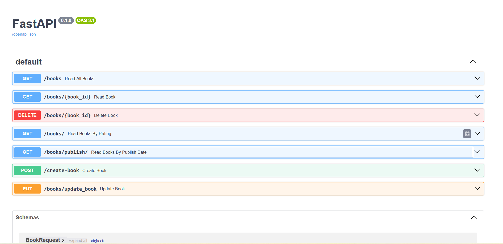

# Fast API 

## Project 1

Applied basic fast api knowledge by creating endpoint and testing using Swagger docs. Very basic app but with the fast api foundations integrated

## Project 2

Created 7 Endpoints that simulate a CRUD functionality for a books management backend, added pydantic base model in order to have proper validation, status code errors and field validation. Separated into a model file(OOP) and the main app in another file. Added path params and query params to make it more robust. DB simulated by a dictionary

## Project 3

Same as project 2 but with the Sqlite3 addition in order to have a proper dabase working with the backend from project 2.

